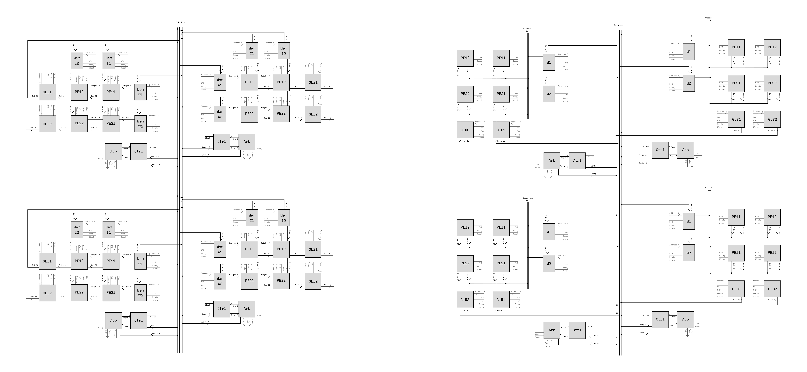

## ML Accelerator Dataflows

This repository houses reproducible code and testbenches to compare an output
stationary dataflow and a weight stationary dataflow in an ML accelerator. It
accompanies a paper at the [Canadian Undergraduate Conference on AI](https://cucai.ca/).

## Instructions
- If you don't want to install any tools but want to play with the hardware modules, try copy-pasting Verilog code in the `src` folder into [EDAPlayground](https://www.edaplayground.com/).
- To **simulate the hardware modules locally**, install [Icarus Verilog](https://steveicarus.github.io/iverilog/usage/installation.html). To compile some file, run `iverilog -o <output> <input>`. To run the compiled file, run `vvp <output>`. Example: `iverilog -o sim_build/sim.vvp src/output/pe.v` and `vvp sim_build/sim.vvp`.
- To **run testbenches** in the `test` folder, run `pip3 install -r test/requirements.txt` to install Cocotb. Then, run `make help_local` for instructions on how to run the testbenches. Example command: `make test MOD_TYPE=output MOD=pe` to test the output-stationary processing element.
  - Note that the testbenches rely on parameters in `parameters.json`. You can modify this file to adjust hardware parameters like memory width.
- To run the scheduler notebooks in the `scheduler` folder, run `pip3 install -r scheduler/requirements.txt` to install Jupyter and other dependencies.